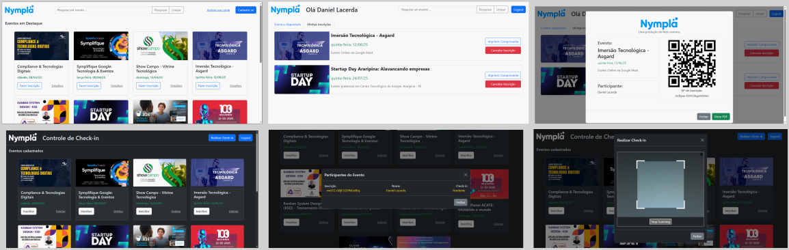

# Projeto Nympla

O projeto consiste em um sistema de gerenciamento de eventos e usuários semelhante ao site Sympla. O sistema irá possibilitar a inscrição em eventos, cadastro e login de usuários, autenticação e autorização, geração de comprovantes de inscrição, check-in de usuários, entre outras funcionalidades.

# Design

Sugestão de design das principais telas do projeto.



# Como executar a parte Back-end do projeto

1. Clonar o projeto ou baixar os arquivo para a sua máquina.
2. Criar o arquivo **.env** dentro da pasta Back-end contendo a url de conexão com o seu banco e a chave para gerar o JWT:

```
POSTGRES_URL="postgresql://<user>:<senha>@localhost:5432/nympla"
SECRET_KEY="sua-chave-secreta"
```

3. Instalar as dependências executando o comando abaixo dentro da pasta Back-end:

```
npm i
```

4. Executar o servidor (Back-end) com o comando:

```
npm run dev
```

# Dev Log

**Aula 09 - 02/04 (quarta-CD)**

- [x] Implementação da tela de **Login** e integração com o back-end.
  - [x] Criação do arquivo login.js e início da integração com o Back-end
  - [x] Finalização do estilo tela de login.html

**Aula 08 - 02/04 (quarta-AB)**

- [x] Implementação da tela de **Login** e integração com o back-end.
  - [x] Criação da pasta **Front-end** e arquivo login.html
  - [x] Finalização da implementação do UseService.js corrigindo os códigos de retorno
  - [x] Estilização da página de login utilizando **Bootstrap**

**Aula 07 - 01/04 (terça)**

- [x] Implementação da rota **/event/all**.
  - [x] Criação da tabela **events** e inserção de eventos (o sql se encontra na pasta Database)
  - [x] Criação dos arquivos EventController.js, EventService.js, EventRepository.js e Event.js
  - [x] OBS: Essa implementação foi realizada como prova prática em sala

**Aula 06 - 31/03 (segunda)**

- [x] Implementação da geraçao de tokens JWT e criação da rota protegida **/auth/profile**.
  - [x] Instalação do pacote **jsonwebtoken**
  - [x] Geração do Token JWT na rota **user/login**
  - [x] Implementação da função de autenticação e validação de tokens para rotas protegidas (arquivo AuthenticateToken.js)
  - [x] OBS: No arquivo .env deve constar a chave secreta para a geração do token (SECRET_KEY="sua chave secreta")

**Aula 05 - 27/03 (quinta)**

- [x] Início da implementação da rota **/user/login**.
  - [x] Finalizada da rota **user/register**
  - [x] Implementado o servico de login no UserService.js
  - [x] Implementada a comparação da senha do usuário com a sua hash no banco através do pacote **bcryptjs**.
  - [x] Implementada função **getUserByEmail** no UserRepository.js
  - [x] Implementada tratativa de erros de acordo com os códigos HTTP.

**Aula 04 - 24/03 (segunda)**

- [x] Início da implementação da rota **/user/register**.
  - [x] Implementado para tratar a rota no UserController.js
  - [x] Implementado o servico de registro no UserService.js
  - [x] Instalado o pacote **bcryptjs** para criptografar a senha do usuário antes de salvar no banco de dados.

**Aula 03 - 18/03 (terça)**

- [x] Criação da pasta **repositories** e implementação das classes para acesso ao banco de dados postgres. Download da dependencia **dotenv** para gerenciar as informações de variáveis de ambiente.
  - [x] Criação do PgDatabase.js
  - [x] Criação do UserRepository.js
  - [x] Criação da base de dados chamada **nympla** no PgAdmin
  - [x] Criação da tabela **users** e inserido alguns usuários (sqls na pasta Database)
  - [x] Implementação da funcionalidade de listar todos os usuários
  - [x] Criação do arquivo **.env** que guarda a url de conexao do banco. **OBS:** o arquivo .env não é carregado para o github, devendo o aluno criar na basta Back-end do seu projeto local.

**Aula 02 - 18/03 (terça)**

- [x] Criação das pastas **entities** e **services**
  - [x] Criação do User.js
  - [x] Criação do UserService.js
  - [x] Atualização do UserControler.js

**Aula 01 - 17/03 (segunda)**

- [x] Definição da estrutura do projeto e download das dependências **express** e **pg**
  - [x] Criação do Server.js
  - [x] Criação do Routes.js
  - [x] Criação do UserControler.js
